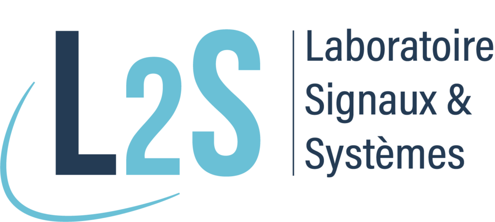
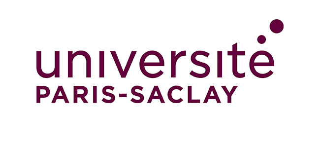
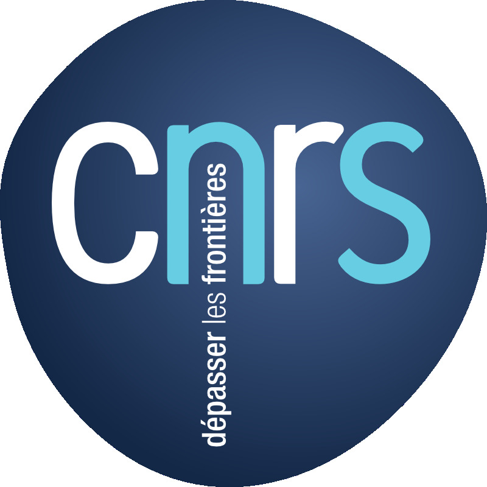
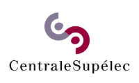
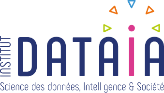
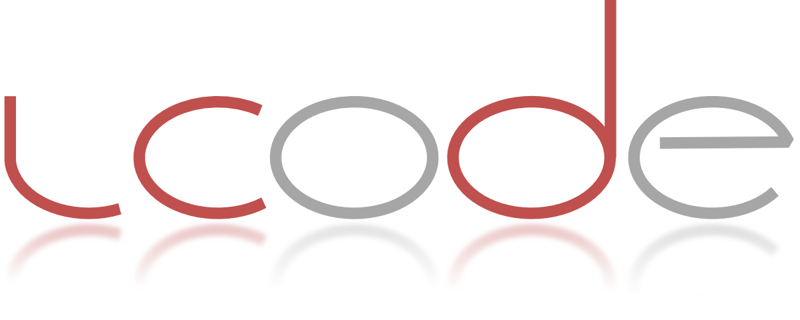

The goal of S³ is to welcome recognized researchers, PhD students and post-docs
on the field of signal processing, data science and its applications. It is open
to everyone and is usually hosted Friday morning 11:00 am, "Salle des séminaire"
C4.01 (C stairs, 4th floor), CentraleSupélec, Breguet Building.

_NB: Due to the health situation, the seminar went online only. We use the
[Hestia](https://hestia.universite-paris-saclay.fr/) service from University
Paris-Saclay, which is **web based and does not require an account for the
audience**._

   

### Information

- You can subscribe to the _mailing list_ to receive annoucments
  - by submitting your email in the [subscribe
    page](https://listes.centralesupelec.fr/wws/subscribe/s3.seminar) or
  - sending a mail with subject `subscribe s3.seminar` to [sympa AT listes.centralesupelec.fr](mailto:sympa@listes.centralesupelec.fr?subject=sub%20s3.seminar) 
<!-- - You can follow S³ on  [Twitter](https://twitter.com/s3_seminar) (we tweet only about scientific events). -->
<!-- - Slides, when available, are hosted at [Speaker Deck](https://speakerdeck.com/s3_seminar). -->
<!-- - S³ is mostly supported by the [L2S](https://www.l2s.centralesupelec.fr/) for the moment. -->
- Do not hesitate to [contact us](mailto:seminaire.scube@l2s.centralesupelec.fr) if you wish to give a talk or for any other reason.

### Organizers

[François Orieux](https://pro.orieux.fr) and [Hani Hamdan](https://www.l2s.centralesupelec.fr/u/hamdan-hani/).

